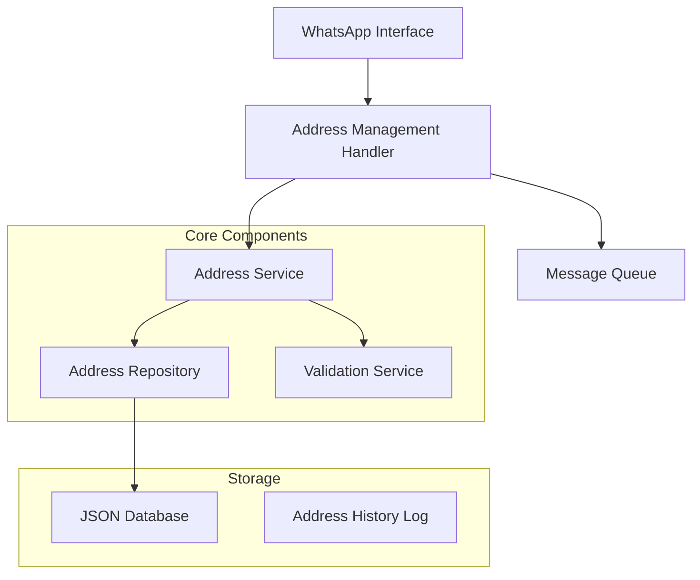

# Design Document - Courier Address Management

## Overview

Sistem manajemen alamat kurir adalah fitur yang terintegrasi dengan aplikasi WhatsApp bot existing untuk memungkinkan kurir mengelola alamat pelanggan secara efisien. Sistem ini akan menyimpan, memvalidasi, dan mengelola alamat pelanggan dengan fokus pada kemudahan penggunaan melalui interface chat WhatsApp.

## Architecture

### High-Level Architecture



### Integration Points

- **WhatsApp Bot Framework**: Menggunakan struktur existing dari `index.js` dan `Amane.js`
- **Database System**: Memanfaatkan sistem JSON database existing di folder `data/`
- **Message Queue**: Integrasi dengan `lib/messageQueue.js` untuk handling async operations

## Components and Interfaces

### 1. Address Management Handler (`lib/addressManager.js`)

**Purpose**: Menangani semua command dan interaction terkait manajemen alamat

**Key Methods**:
```javascript
class AddressManager {
    async handleAddressCommand(message, command, args)
    async showAddressMenu(chatId)
    async processAddressEdit(chatId, addressId, newData)
    async searchAddresses(query, courierId)
    async addNewAddress(addressData, courierId)
}
```

### 2. Address Service (`storage/AddressService.js`)

**Purpose**: Business logic untuk operasi alamat

**Key Methods**:
```javascript
class AddressService {
    async createAddress(addressData)
    async updateAddress(addressId, updates)
    async searchAddresses(searchTerm, filters)
    async getAddressHistory(customerId)
    async markAddressAsProblematic(addressId, reason)
    async validateAddress(addressData)
}
```

### 3. Address Repository (`storage/AddressRepository.js`)

**Purpose**: Data access layer untuk alamat

**Key Methods**:
```javascript
class AddressRepository {
    async save(address)
    async findById(id)
    async findByCustomer(customerId)
    async search(criteria)
    async update(id, data)
    async delete(id)
}
```

## Data Models

### Address Model

```javascript
{
    id: "addr_001",
    customerId: "cust_001",
    customerName: "John Doe",
    customerPhone: "6281234567890",
    address: {
        street: "Jl. Merdeka No. 123",
        district: "Kecamatan ABC",
        city: "Jakarta",
        postalCode: "12345",
        landmark: "Dekat Masjid Al-Ikhlas"
    },
    coordinates: {
        latitude: -6.2088,
        longitude: 106.8456
    },
    status: "verified", // verified, unverified, problematic
    verifiedBy: "courier_001",
    verifiedAt: "2024-12-19T10:30:00Z",
    notes: "Rumah cat hijau, pagar putih",
    createdBy: "courier_001",
    createdAt: "2024-12-19T09:00:00Z",
    lastUsed: "2024-12-19T14:30:00Z",
    usageCount: 5,
    isProblematic: false,
    problematicReason: null,
    tags: ["regular_customer", "easy_access"]
}
```

### Address History Model

```javascript
{
    id: "hist_001",
    addressId: "addr_001",
    action: "updated", // created, updated, used, marked_problematic
    changes: {
        field: "address.street",
        oldValue: "Jl. Merdeka No. 122",
        newValue: "Jl. Merdeka No. 123"
    },
    performedBy: "courier_001",
    timestamp: "2024-12-19T10:30:00Z",
    reason: "Koreksi nomor rumah"
}
```

## User Interface Design

### WhatsApp Command Structure

**Main Commands**:
- `.alamat` - Menu utama manajemen alamat
- `.cari [nama/nomor]` - Cari alamat
- `.tambah` - Tambah alamat baru
- `.edit [id]` - Edit alamat existing

**Interactive Flows**:

1. **Address Search Flow**:
   ```
   User: /cari John
   Bot: 🔍 Hasil pencarian "John":
        1. John Doe - Jl. Merdeka 123 ✅
        2. John Smith - Jl. Sudirman 456 ⚠️
        
        Ketik nomor untuk memilih atau /batal
   ```

2. **Address Edit Flow**:
   ```
   User: /edit addr_001
   Bot: 📝 Edit Alamat:
        Nama: John Doe
        HP: 081234567890
        Alamat: Jl. Merdeka No. 123
        
        Pilih yang ingin diedit:
        1️⃣ Nama
        2️⃣ Nomor HP
        3️⃣ Alamat
        4️⃣ Catatan
        5️⃣ Tandai bermasalah
   ```

### Menu System

```mermaid
graph TD
    A[/alamat] --> B[Menu Utama]
    B --> C[🔍 Cari Alamat]
    B --> D[➕ Tambah Alamat]
    B --> E[📋 Alamat Bermasalah]
    B --> F[📊 Statistik]
    
    C --> G[Input Pencarian]
    G --> H[Hasil Pencarian]
    H --> I[Pilih Alamat]
    I --> J[Detail & Aksi]
    
    D --> K[Form Alamat Baru]
    K --> L[Validasi]
    L --> M[Simpan]
```

## Error Handling

### Validation Errors
- **Missing Required Fields**: Pesan error spesifik untuk field yang kosong
- **Invalid Phone Format**: Validasi format nomor telepon Indonesia
- **Duplicate Address**: Deteksi alamat duplikat berdasarkan similarity

### System Errors
- **Database Connection**: Fallback ke cache local jika database tidak tersedia
- **WhatsApp API Limits**: Queue management untuk menghindari rate limiting
- **Memory Management**: Cleanup untuk data alamat yang tidak terpakai

### Error Response Format
```javascript
{
    success: false,
    error: {
        code: "VALIDATION_ERROR",
        message: "Nomor telepon tidak valid",
        field: "customerPhone",
        details: "Format nomor harus dimulai dengan 62 atau 08"
    }
}
```

## Testing Strategy

### Unit Testing
- **Address Service**: Test semua business logic methods
- **Address Repository**: Test CRUD operations
- **Validation Functions**: Test semua validation rules

### Integration Testing
- **WhatsApp Flow**: Test complete user interaction flows
- **Database Operations**: Test data persistence and retrieval
- **Message Queue**: Test async operation handling

### Test Data Management
- **Mock Addresses**: Set alamat dummy untuk testing
- **Test Scenarios**: Cover happy path dan edge cases
- **Performance Testing**: Test dengan volume data besar

### Testing Tools
- **Jest**: Unit testing framework
- **Supertest**: API testing
- **Mock WhatsApp**: Simulate WhatsApp interactions

## Performance Considerations

### Database Optimization
- **Indexing**: Index pada customerPhone dan customerName untuk pencarian cepat
- **Caching**: Cache alamat yang sering digunakan
- **Pagination**: Limit hasil pencarian untuk performa

### Memory Management
- **Data Cleanup**: Hapus data temporary setelah operasi selesai
- **Connection Pooling**: Reuse database connections
- **Lazy Loading**: Load data alamat hanya saat diperlukan

### WhatsApp API Optimization
- **Message Batching**: Group multiple updates dalam satu message
- **Rate Limiting**: Respect WhatsApp API limits
- **Async Processing**: Use message queue untuk operasi berat